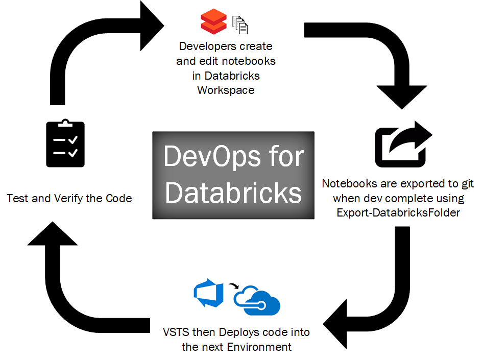
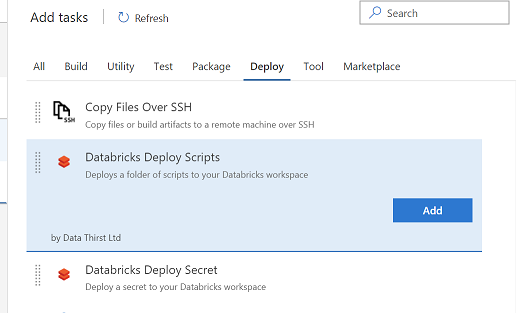
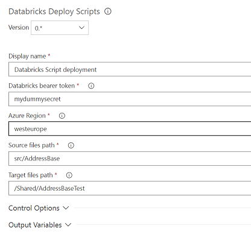
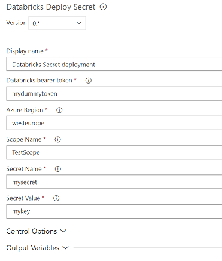

# Deploying to Databricks

## Process

# VSTS Tasks

## Add task
Your will find the new Tasks available under the Deploy tab, or search for Databricks:

## Deploying Scripts
Use this to deploy a folder of scripts from your repo to your Databricks Workspace. 

### Parameters
- Bearer Token - This is your API key, get it from the Databricks workspace for your user account
- Azure Region - The region your instance is in. This can be taken from the start of your workspace URL (it must not contain spaces)
- Source Files Path - the path to your scripts (note that sub folders will also be deployed)
- Target Files Path - this is the location in your workspace to deploy to, such as /Shared/MyCode - it must start /

## Deploying Secrets
Use this to deploy a folder of scripts from your repo to your Databricks Workspace. 

### Parameters
- Bearer Token - This is your API key, get it from the Databricks workspace for your user account
- Azure Region - The region your instance is in. This can be taken from the start of your workspace URL (it must not contain spaces)
- Scope Name - The Scope to store your variable in
- Secret Name - The Key name
- Secret Value - Your secret value such as a password or key

# Bulk Export Scripts from your Workspace
Please see the PowerShell module: https://github.com/DataThirstLtd/azure.databricks.cicd.tools

# Libraries, Clusters & Jobs
Coming Soon

# History
25 Aug 2018 0.3.1   Minor Bug fix for handling incorrect line endings. Caused some files to export incorrectly