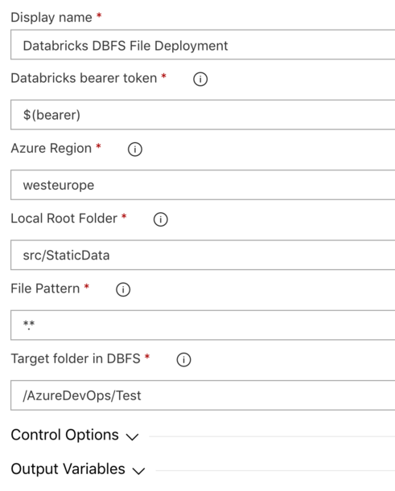

# Deploying to Databricks

This extension has a set of tasks to help with your CI/CD deployments if you are using Notebooks, Python, jars or Scala. These tools are based on the PowerShell module [azure.databricks.cicd.tools](https://github.com/DataThirstLtd/azure.databricks.cicd.tools) available through PSGallery. The module has much more functionality if you require it.

**Now works with Service Principal Authentication (PREVIEW)**

# Azure DevOps Tasks

## Add task
You will find the new Tasks available under the Deploy tab, or search for Databricks:

## Deploying Files to DBFS
Use this to deploy a file or pattern of files to DBFS. Typically this is used for jars, py files or data files such as csv. Now supports large files.

### Parameters
- Azure Region - The region your instance is in. This can be taken from the start of your workspace URL (it must not contain spaces)
- Local Root Path - the path to your files, for example $(System.DefaultWorkingDirectory)/drop
- File Pattern - files to copy, examples *.* or *.py
- Target folder in DBFS - Path to folder in DBFS, must be from root and start with a forwardslash. For example /folder/subfolder

## Deploying Notebooks
Use this to deploy a folder of notebooks from your repo to your Databricks Workspace. 

### Parameters
- Azure Region - The region your instance is in. This can be taken from the start of your workspace URL (it must not contain spaces)
- Source Files Path - the path to your scripts (note that sub folders will also be deployed)
- Target Files Path - this is the location in your workspace to deploy to, such as /Shared/MyCode - it must start /

## Deploying Secrets
Use this to deploy a folder of scripts from your repo to your Databricks Workspace. If the Secret scope does not exist it will be created for you (note all user access to the scope will be granted).

### Parameters
- Azure Region - The region your instance is in. This can be taken from the start of your workspace URL (it must not contain spaces)
- Scope Name - The Scope to store your variable in
- Secret Name - The Key name
- Secret Value - Your secret value such as a password or key

## Process

# Bulk Export Scripts from your Workspace
Please see the PowerShell module: https://github.com/DataThirstLtd/azure.databricks.cicd.tools

# Libraries, Clusters & Jobs
These tools are based on the PowerShell module [azure.databricks.cicd.tools](https://github.com/DataThirstLtd/azure.databricks.cicd.tools) available through PSGallery. The module has much more functionality if you require it for Libraries, Jobs and Cluster management.

# History
- 18 Oct 2019 0.6   Added support for Service Principal Authentication
- 18 Oct 2019 0.6   Added support for cleaning workspace folder before deploying
- 25 Nov 2018 0.5   Added support for DBFS files over 1MB
- 14 Nov 2018 0.4   Added DBFS file uploads and provided updates to run on PowerShell
- 25 Aug 2018 0.3   Minor Bug fix for handling incorrect line endings. Caused some files to export incorrectly